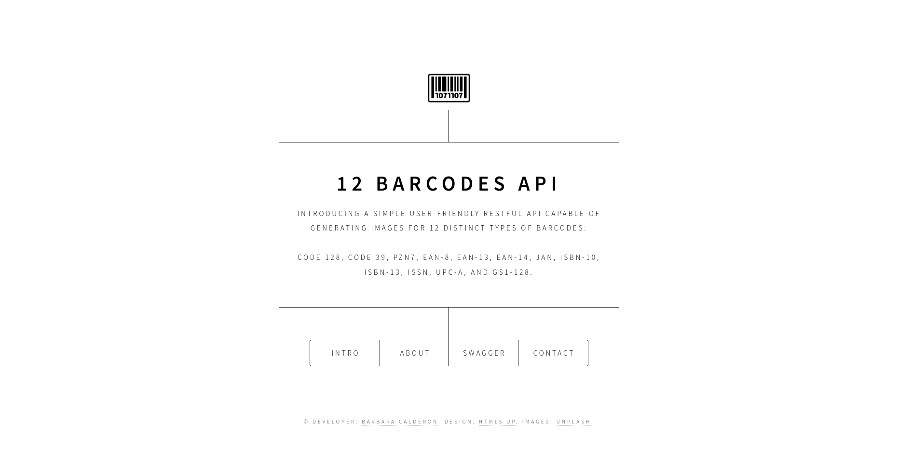

# The 12 Barcodes API

[**The 12 Barcodes API**](https://the-12-barcodes-api.onrender.com/) is a user-friendly RESTful API designed to provide a simple and practical solution for generating barcodes in applications. Developed in the Flask ecosystem and adopting the MVC architecture, this API offers ease of integration and flexibility. It forgoes the traditional database setup, streamlining the development process and reducing complexity. Checkout  [**The 12 Barcodes API Swagger**](https://the-12-barcodes-api.onrender.com/swagger-ui) documentation.

This API may be of particular interest to **developers, event organizers, manufacturers and suppliers, library technicians and archivists, students and educators**. 


## Author

I'm Barbara Calderon, a software developer from Brazil. 
- [Github](https://www.github.com/barbaracalderon)
- [Linkedin](https://www.linkedin.com/in/barbaracalderondev)
- [Twitter](https://www.x.com/bederoni)


## Run locally

### 1. Clone the repo

```bash
git clone https://github.com/barbaracalderon/the-12-barcodes-api
```

### 2. Enter the project directory

```bash
cd project-name
```

### 3. Install dependencies

Make sure you have Python installed.

```bash
pip install -r requirements.txt
```

### 4. Run 

```bash
gunicorn --bind "0.0.0.0:80" wsgi:app
```

## API Documentation

#### HTTP

| Method      | Returns                       | Object Format   |
|-------------|-------------------------------|-----------------|
| GET         | Retrieves barcode information | JSON           |
| POST        | Retrieves barcode image       | PNG            |


#### POST endpoints


| Endpoint   | Parameter      | Type   | Description |
|------------|----------------|--------|-------------|
| /ean-8     | `product_data` | String | Required    |
| /ean-14    | `product_data` | String | Required    |
| /gs1-128   | `product_data` | String | Required    |
| /isbn-10   | `product_data` | String | Required    |
| /isbn-13   | `product_data` | String | Required    |
| /issn      | `product_data` | String | Required    |
| /jan       | `product_data` | String | Required    |
| /code-128  | `product_data` | String | Required    |
| /code-39   | `product_data` | String | Required    |
| /pzn7      | `product_data` | String | Required    |
| /upc-a     | `product_data` | String | Required    |


## Stack used

**Frontend**

- HTML5UP
- SCSS
- Javascript

**Backend**

- Flask
- Flask-Smorest
- Marshmallow
- BytesIO
- GUnicorn


## Improvements

Implementing **tests** for this project will significantly enhance its reliability and stability. With the test directory already set up using Poetry and pytest, we there is a foundation for creating comprehensive test suites. Hopefully they will be coming soon to further strengthen the project's robustness and maintainability.
## Contributions

Encouraging contributions from the community is vital for the success and growth of any project. We could greatly improve by adopting tests.

**Reporting Issues**: If you encounter any bugs, glitches, or unexpected behavior, please don't hesitate to report them. You can do so by opening an issue on our GitHub repository. Be sure to include detailed information about the problem you're experiencing, including steps to reproduce it and any relevant error messages.

**Submitting Pull Requests**: We welcome contributions in the form of code fixes or improvements to existing functionality. If you'd like to contribute code, please submit a pull request on GitHub. Please include documentation for any changes you propose.

## License

[GNU General Public Licence v3.0](https://choosealicense.com/licenses/gpl-3.0/)

